# BÁO CÁO KỸ THUẬT ĐỒ ÁN BIG DATA
## HỆ KHUYẾN NGHỊ SẢN PHẨM CHO SÀN THƯƠNG MẠI ĐIỆN TỬ
**Giảng viên hướng dẫn:** Bộ môn Khoa học Dữ liệu & Hệ thống Thông tin - HUIT  
**Thành viên thực hiện:** PHƯƠNG (Chuyên viên Phân tích & Kỹ sư Dữ liệu)  
**Phạm vi phụ trách:** CHƯƠNG 1 (TỔNG QUAN) & CHƯƠNG 3 (TIỀN XỬ LÝ VÀ PHÂN TÍCH DỮ LIỆU)  
**Ngày hoàn thiện:** Tháng 10/2026  

---

# MỤC LỤC
- [CHƯƠNG 1: TỔNG QUAN HỆ THỐNG KHUYẾN NGHỊ THƯƠNG MẠI ĐIỆN TỬ](#chương-1-tổng-quan-hệ-thống-khuyến-nghị-thương-mại-điện-tử)
  - [1.1. Bối cảnh và Thách thức quá tải thông tin trong TMĐT](#11-bối-cảnh-và-thách-thức-quá-tải-thông-tin-trong-tmđt)
  - [1.2. Tổng quan về Hệ khuyến nghị (Recommender Systems)](#12-tổng-quan-về-hệ-khuyến-nghị-recommender-systems)
  - [1.3. Khảo sát Bộ dữ liệu RetailRocket Recommender System](#13-khảo-sát-bộ-dữ-liệu-retailrocket-recommender-system)
  - [1.4. Mục tiêu và Tiêu chí đánh giá hệ thống](#14-mục-tiêu-và-tiêu-chí-đánh-giá-hệ-thống)
- [CHƯƠNG 3: PHÂN TÍCH DỮ LIỆU (EDA) VÀ TIỀN XỬ LÝ DỮ LIỆU LỚN VỚI APACHE SPARK](#chương-3-phân-tích-dữ-liệu-eda-và-tiền-xử-lý-dữ-liệu-lớn-với-apache-spark)
  - [3.1. Phân tích Khám phá Dữ liệu Chuyên sâu (Exploratory Data Analysis - EDA)](#31-phân-tích-khám-phá-dữ-liệu-chuyên-sâu-exploratory-data-analysis---eda)
    - [3.1.1. Thống kê tổng quan tập dữ liệu](#311-thống-kê-tổng-quan-tập-dữ-liệu)
    - [3.1.2. Phân bố các loại hành vi người dùng (Event Types) & Phễu chuyển đổi (Conversion Funnel)](#312-phân-bố-các-loại-hành-vi-người-dùng-event-types--phễu-chuyển-đổi-conversion-funnel)
    - [3.1.3. Phân tích hành vi theo chu kỳ thời gian (Giờ & Thứ trong tuần)](#313-phân-tích-hành-vi-theo-chu-kỳ-thời-gian-giờ--thứ-trong-tuần)
    - [3.1.4. Phân tích tương tác người dùng và hiện tượng Long-Tail](#314-phân-tích-tương-tác-người-dùng-và-hiện-tượng-long-tail)
    - [3.1.5. Danh mục Top 10 sản phẩm thịnh hành (Cold-Start Candidates)](#315-danh-mục-top-10-sản-phẩm-thịnh-hành-cold-start-candidates)
  - [3.2. Cơ chế Quy đổi Phản hồi Ẩn (Implicit Feedback) thành Điểm tương tác (Rating Score)](#32-cơ-chế-quy-đổi-phản-hồi-ẩn-implicit-feedback-thành-điểm-tương-tác-rating-score)
    - [3.2.1. Thách thức của Implicit Feedback so với Explicit Feedback](#321-thách-thức-của-implicit-feedback-so-với-explicit-feedback)
    - [3.2.2. Kế thừa bản thảo Tuần 3 và hoàn thiện công thức tính điểm tương tác](#322-kế-thừa-bản-thảo-tuần-3-và-hoàn-thiện-công-thức-tính-điểm-tương-tác)
  - [3.3. Xây dựng Luồng Tiền Xử Lý Dữ Liệu Lớn (ETL Pipeline) trên Cụm Apache Spark](#33-xây-dựng-luồng-tiền-xử-lý-dữ-liệu-lớn-etl-pipeline-trên-cụm-apache-spark)
    - [3.3.1. Kiến trúc luồng xử lý phân tán](#331-kiến-trúc-luồng-xử-lý-phân-tán)
    - [3.3.2. Quy trình làm sạch dữ liệu (Deduplication, Validation, Type Casting)](#332-quy-trình-làm-sạch-dữ-liệu-deduplication-validation-type-casting)
  - [3.4. Xây dựng Ma trận Tương tác User-Item 3 cột chuẩn cho Mô hình ALS](#34-xây-dựng-ma-trận-tương-tác-user-item-3-cột-chuẩn-cho-mô-hình-als)
    - [3.4.1. Cấu trúc bảng ma trận tương tác](#341-cấu-trúc-bảng-ma-trận-tương-tác)
    - [3.4.2. Phân tích độ thưa (Sparsity Matrix) và hiệu quả lưu trữ Parquet trên HDFS](#342-phân-tích-độ-thưa-sparsity-matrix-và-hiệu-quả-lưu-trữ-parquet-trên-hdfs)

---

# CHƯƠNG 1: TỔNG QUAN HỆ THỐNG KHUYẾN NGHỊ THƯƠNG MẠI ĐIỆN TỬ

## 1.1. Bối cảnh và Thách thức quá tải thông tin trong TMĐT
Trong kỷ nguyên bùng nổ của nền kinh tế số và sàn thương mại điện tử (E-commerce), số lượng sản phẩm trên mỗi nền tảng có thể lên tới hàng trăm nghìn hoặc hàng chục triệu mã hàng khác nhau (SKUs). Người tiêu dùng hiện đại đối mặt với hội chứng "Quá tải thông tin" (Information Overload), khi việc tìm kiếm món đồ phù hợp giữa hàng triệu sản phẩm tốn kém rất nhiều thời gian và làm suy giảm trải nghiệm mua sắm.

Hệ thống khuyến nghị (Recommender System) đóng vai trò như một trợ lý mua sắm ảo thông minh:
- **Đối với khách hàng:** Giúp rút ngắn thời gian tìm kiếm, khám phá các sản phẩm phù hợp với sở thích và nhu cầu cá nhân.
- **Đối với doanh nghiệp:** Tăng tỷ lệ chuyển đổi (Conversion Rate - CVR), giá trị trung bình trên mỗi đơn hàng (Average Order Value - AOV), kéo dài thời gian lưu trữ trên website và giữ chân khách hàng trung thành.

## 1.2. Tổng quan về Hệ khuyến nghị (Recommender Systems)
Các hệ thống gợi ý hiện đại được phân loại thành ba nhóm phương pháp chính:
1. **Lọc dựa trên nội dung (Content-Based Filtering):** Khuyến nghị các mặt hàng có thuộc tính tương tự như những mặt hàng người dùng đã thích trong quá khứ (ví dụ cùng thể loại, thương hiệu, mức giá). Hạn chế lớn là thiếu tính đa dạng và không tận dụng được trí tuệ đám đông.
2. **Lọc cộng tác (Collaborative Filtering - CF):** Phương pháp dựa trên giả định rằng các cá nhân có sở thích tương tự trong quá khứ sẽ có xu hướng lựa chọn giống nhau trong tương lai. CF chia thành hai hướng:
   - *Memory-based:* Dựa trên độ tương đồng giữa User-User hoặc Item-Item (k-NN).
   - *Model-based:* Sử dụng các mô hình học máy, phân rã ma trận (Matrix Factorization) như **ALS (Alternating Least Squares)**, SVD để biểu diễn người dùng và sản phẩm trong không gian vector ẩn (Latent Factor Space).
3. **Hệ thống lai (Hybrid Recommender Systems):** Kết hợp giữa Content-Based và Collaborative Filtering nhằm bù trừ nhược điểm của nhau.

Đồ án này tập trung hiện thực hóa mô hình **Collaborative Filtering trên nền tảng Big Data**, cụ thể là thuật toán **ALS (Alternating Least Squares)** của thư viện Apache Spark MLlib, tối ưu hóa cho dữ liệu phản hồi ẩn (Implicit Feedback) quy mô lớn.

## 1.3. Khảo sát Bộ dữ liệu RetailRocket Recommender System
Bộ dữ liệu được cung cấp bởi công ty cá nhân hóa thương mại điện tử **RetailRocket** trên nền tảng Kaggle. Dữ liệu ghi nhận lại toàn bộ hành vi duyệt web của người dùng thực tế trên một sàn thương mại điện tử trong vòng 4,5 tháng (từ ngày 03/05/2015 đến 18/09/2015).

Tập dữ liệu bao gồm 3 tệp tin chính:
1. `events.csv`: Tệp tin cốt lõi chứa **2,756,101 dòng tương tác**.
   - `timestamp`: Thời điểm diễn ra tương tác tính bằng Unix epoch milliseconds.
   - `visitorid`: Mã định danh người dùng (Unique User ID).
   - `event`: Loại hành vi tương tác, gồm 3 loại: `view` (xem chi tiết), `addtocart` (thêm vào giỏ), `transaction` (đặt hàng).
   - `itemid`: Mã định danh sản phẩm (Unique Product ID).
   - `transactionid`: Mã đơn hàng đối với các sự kiện giao dịch mua.
2. `category_tree.csv`: Cây phân cấp danh mục ngành hàng (chứa 14,454 dòng quan hệ danh mục cha - con).
3. `item_properties_part1.csv` & `item_properties_part2.csv`: Thuộc tính động của sản phẩm theo thời gian (giá tiền, categoryid, trạng thái mở bán...).

## 1.4. Mục tiêu và Tiêu chí đánh giá hệ thống
- **Lưu trữ dữ liệu lớn:** Lưu trữ toàn bộ dữ liệu trên hệ thống tệp phân tán Hadoop HDFS (HDFS NameNode & DataNode), sử dụng định dạng cột Parquet nén Snappy.
- **Xử lý tính toán phân tán:** Xây dựng luồng tiền xử lý ETL bằng Spark RDD/DataFrame trên cụm phân tán Spark Standalone.
- **Mô hình học máy:** Huấn luyện thuật toán ALS Implicit Feedback của Spark MLlib trên ma trận tương tác User-Item, tối ưu hóa siêu tham số bằng Grid Search và đánh giá qua RMSE.
- **Xử lý Cold-Start:** Xây dựng luồng dự phòng gợi ý Top sản phẩm bán chạy/thịnh hành cho người dùng mới chưa từng có lịch sử tương tác.
- **Ứng dụng giao diện Web:** Trực quan hóa kết quả khuyến nghị thông qua bảng điều khiển Streamlit hiện đại.

---

# CHƯƠNG 3: PHÂN TÍCH DỮ LIỆU (EDA) VÀ TIỀN XỬ LÝ DỮ LIỆU LỚN VỚI APACHE SPARK

## 3.1. Phân tích Khám phá Dữ liệu Chuyên sâu (Exploratory Data Analysis - EDA)

### 3.1.1. Thống kê tổng quan tập dữ liệu
Qua việc thực thi quy trình phân tích tự động trên toàn bộ 2,756,101 bản ghi của tệp `events.csv`, nhóm đã trích xuất được bảng thông số đặc trưng cốt lõi sau:

| Chỉ số thống kê (Metric) | Giá trị ghi nhận | Ý nghĩa thực tế trong hệ thống |
| :--- | :--- | :--- |
| **Tổng số sự kiện (Total Records)** | **2,756,101** | Quy mô dữ liệu lớn, cần cụm phân tán để xử lý |
| **Số người dùng độc nhất (Unique Users)** | **1,407,580** | Không gian người dùng $U$ rất lớn |
| **Số sản phẩm độc nhất (Unique Items)** | **235,061** | Không gian mặt hàng $I$ đa dạng |
| **Thời gian bắt đầu** | 2015-05-03 03:00:04 | Bắt đầu chu kỳ theo dõi |
| **Thời gian kết thúc** | 2015-09-18 02:59:47 | Kết thúc chu kỳ (kéo dài ~4.5 tháng) |
| **Bản ghi trùng lặp (Duplicates)** | **460** bản ghi (0.017%) | Cần loại bỏ trong giai đoạn ETL |
| **Giá trị Null ở các cột định danh** | 0 bản ghi | Trường visitorid, itemid, event toàn vẹn 100% |

### 3.1.2. Phân bố các loại hành vi người dùng (Event Types) & Phễu chuyển đổi (Conversion Funnel)
Một trong những đặc điểm nổi bật nhất của bài toán thương mại điện tử là **sự mất cân bằng cực lớn giữa các cấp độ hành vi**.

| Loại hành vi (Event Type) | Số lượng bản ghi | Tỷ lệ phần trăm | Mức độ cam kết hành vi |
| :--- | :--- | :--- | :--- |
| **View (Xem chi tiết)** | 2,664,312 | **96.67%** | Tương tác bề mặt, khám phá |
| **AddToCart (Thêm vào giỏ)** | 69,332 | **2.52%** | Cân nhắc mua, ý định cao |
| **Transaction (Mua hàng)** | 22,457 | **0.81%** | Quyết định chi tiêu, hoàn tất đơn |

  
*Hình 3.1: Phân bố số lượng các loại hành vi người dùng (Thang đo Logarit)*

**Phân tích Phễu chuyển đổi (E-commerce Conversion Funnel):**
- Tỷ lệ chuyển đổi từ Xem sang Thêm giỏ hàng ($\text{View} \to \text{Cart}$): **2.60%**. Nghĩa là cứ khoảng 38 lượt xem sản phẩm mới có 1 lượt đưa vào giỏ.
- Tỷ lệ chuyển đổi từ Thêm giỏ hàng sang Mua hàng ($\text{Cart} \to \text{Transaction}$): **32.39%**. Gần 1/3 số lượt đưa vào giỏ sẽ tiến tới thanh toán thành công.
- Tỷ lệ chuyển đổi tổng thể ($\text{View} \to \text{Transaction}$): **0.84%** (cứ 119 lượt xem thì có 1 giao dịch thực tế phát sinh).

  
*Hình 3.2: Phễu chuyển đổi hành vi người dùng qua các giai đoạn (Conversion Funnel)*

Nhận xét: Tỷ lệ chuyển đổi này hoàn toàn tương đồng với các báo cáo chuẩn của ngành E-commerce toàn cầu (CVR dao động từ 1% - 3%). Điều này khẳng định tập dữ liệu RetailRocket phản ánh chân thực hành vi người dùng thực tế.

### 3.1.3. Phân tích hành vi theo chu kỳ thời gian (Giờ & Thứ trong tuần)
Việc khảo sát mật độ tương tác theo thời gian giúp hệ thống xác định được thời điểm người dùng hoạt động tích cực nhất, từ đó lên kế hoạch định kỳ (Batch Job / DAG Schedule) chạy huấn luyện lại mô hình mà không ảnh hưởng tới tải hệ thống phục vụ.

  
*Hình 3.3: Mật độ tương tác theo 24 khung giờ trong ngày (Giờ UTC)*

- **Theo khung giờ trong ngày:**
  - Lượng tương tác bắt đầu tăng mạnh từ 11:00 UTC, đạt đỉnh cao nhất trong khoảng từ **18:00 UTC đến 02:00 UTC** (tương ứng với khung giờ trưa và tối muộn tại các thị trường chính).
  - Khung giờ thấp điểm nhất là từ **05:00 UTC đến 09:00 UTC** (thời điểm rạng sáng). Đây là khoảng thời gian lý tưởng nhất để chạy các tiến trình phân tán nặng như Spark ALS Training hoặc luồng Data Ingestion.

  
*Hình 3.4: Tổng số lượt tương tác theo các ngày trong tuần*

- **Theo ngày trong tuần:**
  - Hoạt động tương tác diễn ra cao nhất vào các ngày làm việc giữa tuần (**Thứ 3, Thứ 4, Thứ 5**), đạt xấp xỉ 420,000 - 450,000 sự kiện/ngày.
  - Các ngày cuối tuần (Thứ 7, Chủ nhật) có xu hướng giảm nhẹ do người dùng chuyển dịch sang các hoạt động ngoại khóa ngoài trời.

### 3.1.4. Phân tích tương tác người dùng và hiện tượng Long-Tail
Khi phân tích số lượng tương tác phát sinh bởi từng người dùng, dữ liệu bộc lộ tính chất bất đối xứng cực kỳ gay gắt:
- **Số tương tác trung bình (Mean):** 1.96 tương tác/người dùng.
- **Số tương tác trung vị (Median):** 1.0 tương tác/người dùng.
- **Tương tác tối đa của một người dùng:** 7,757 tương tác (người dùng đặc biệt hoặc bot quét dữ liệu).

| Khoảng số lượng tương tác | Số lượng người dùng | Tỷ lệ phần trăm | Nhận xét hành vi |
| :--- | :--- | :--- | :--- |
| **Chỉ có đúng 1 tương tác** | **1,001,489** | **71.15%** | **Nhóm Cold-Start cực lớn (Khách vãng lai)** |
| **Có 2 tương tác** | 204,119 | 14.50% | Khách hàng bắt đầu duyệt sản phẩm thứ 2 |
| **Có 3 - 4 tương tác** | 108,350 | 7.70% | Người dùng có lịch sử tối thiểu cho CF |
| **Có 5 - 9 tương tác** | 56,120 | 3.99% | Người dùng thường xuyên |
| **Có 10 - 49 tương tác** | 33,215 | 2.36% | Khách hàng trung thành |
| **Có $\ge$ 50 tương tác** | 4,287 | 0.30% | Power users / tài khoản đại lý |

  
*Hình 3.5: Phân bố số lượng tương tác trên mỗi người dùng (Hiện tượng Long-Tail)*

**Ý nghĩa cốt lõi đối với thiết kế thuật toán:**
1. Hơn **71.15% người dùng** chỉ có đúng 1 lần tương tác duy nhất. Đối với nhóm này, mô hình Collaborative Filtering truyền thống sẽ gặp hiện tượng thiếu hụt thông tin trầm trọng (Sparsity Problem). Bắt buộc hệ thống phải tích hợp giải pháp **Cold-Start Fallback (Gợi ý sản phẩm Top Trending)**.
2. Cần kỹ thuật chuẩn hóa để ngăn chặn các tài khoản có số tương tác dị biệt ($\ge 1,000$) thao túng độ tương đồng của ma trận.

### 3.1.5. Danh mục Top 10 sản phẩm thịnh hành (Cold-Start Candidates)
Phân tích thống kê tìm ra các mặt hàng có tần suất tương tác lớn nhất trên toàn hệ thống:

  
*Hình 3.6: Top 10 sản phẩm có tổng lượt tương tác cao nhất trên sàn*

Các mã sản phẩm như `#461686` (3,412 lượt), `#257597` (2,890 lượt), `#386926` (2,541 lượt) là những sản phẩm "quốc dân" thu hút sự quan tâm áp đảo. Đây chính là dữ liệu vàng để Thành viên 4 (Anh) nạp vào bộ đệm của Web Streamlit nhằm gợi ý tức thời cho người dùng chưa đăng nhập hoặc khách hàng mới.

---

## 3.2. Cơ chế Quy đổi Phản hồi Ẩn (Implicit Feedback) thành Điểm tương tác (Rating Score)

### 3.2.1. Thách thức của Implicit Feedback so với Explicit Feedback
Trong các bài toán hệ gợi ý cổ điển (như MovieLens), người dùng cung cấp điểm số đánh giá trực tiếp từ 1 đến 5 sao (**Explicit Feedback**). Khi đó:
- Điểm 5 thể hiện sự yêu thích sâu sắc.
- Điểm 1 thể hiện sự chê bai rõ ràng.
- Ô trống thể hiện người dùng chưa xem bộ phim đó.

Ngược lại, trong bộ dữ liệu E-commerce thực tế như RetailRocket:
- **Không có đánh giá sao tiêu cực:** Khách hàng không thích sản phẩm thì họ chỉ đơn giản là bỏ qua, không để lại dấu vết.
- **Hành vi tương tác mang tính chất phản hồi ẩn (Implicit Feedback):** Mỗi lần click xem, thêm giỏ hay mua hàng chỉ là một tín hiệu phản ánh mức độ quan tâm (Confidence / Preference) chứ không phải điểm số chất lượng sản phẩm.

### 3.2.2. Kế thừa bản thảo Tuần 3 và hoàn thiện công thức tính điểm tương tác
Tại Tuần 3, Thành viên 3 (Huy) đã đề xuất bản thảo ban đầu về việc gán trọng số cho từng sự kiện:
- $w(\text{view}) = 1$
- $w(\text{addtocart}) = 3$
- $w(\text{transaction}) = 5$

Kết hợp với các chỉ số thu được từ quá trình phân tích EDA tại Mục 3.1 (Tỷ lệ chuyển đổi Funnel và sự mất cân bằng giữa các event), Phương đã **chốt phương án tính điểm khoa học và toàn diện** như sau:

#### Bước 1: Tính điểm tương tác tích lũy thô (Raw Interaction Score)
Với mỗi cặp người dùng $u$ và sản phẩm $i$, điểm tương tác thô $S_{u,i}$ là tổng trọng số tích lũy của toàn bộ các sự kiện mà người dùng đó đã thực hiện trên sản phẩm:
$$S_{u,i} = \sum_{e \in E_{u,i}} w(e) = (1.0 \times N_{\text{view}}) + (3.0 \times N_{\text{cart}}) + (5.0 \times N_{\text{buy}})$$

Trong đó:
- $N_{\text{view}}$: Số lần người dùng $u$ xem sản phẩm $i$.
- $N_{\text{cart}}$: Số lần đưa sản phẩm vào giỏ hàng.
- $N_{\text{buy}}$: Số lần đặt mua thành công.

**Cơ sở luận giải tỷ lệ trọng số 1 : 3 : 5:**
- Xem sản phẩm ($w=1$) là hành vi có chi phí nỗ lực thấp nhất (low barrier), chiếm 96.67% dữ liệu.
- Thêm vào giỏ ($w=3$) thể hiện mức độ cam kết cao hơn gấp 3 lần, vì người dùng phải nghiên cứu thông số và cân nhắc mua (tỷ lệ chỉ 2.52%).
- Đặt mua ($w=5$) là hành vi tối thượng của sàn thương mại điện tử, đòi hỏi người dùng cam kết tài chính thực tế.

#### Bước 2: Chuẩn hóa phân phối điểm số
Để kiểm tra phân bố điểm số sau khi gom nhóm, Phương đã trích xuất Biểu đồ 3.7:

  
*Hình 3.7: Phân bố điểm tương tác quy đổi Implicit Rating theo cặp (User, Item)*

Dữ liệu cho thấy:
- Hơn **82.4% các cặp (User, Item)** có điểm số bằng 1.0 (chỉ xem 1 lần).
- Khoảng **9.6%** có điểm bằng 2.0 (xem lại sản phẩm lần 2).
- Các cặp đạt điểm từ 3.0 trở lên (có giỏ hàng hoặc mua) chiếm gần **8%**.
- Một số ít người dùng có điểm tương tác vượt ngưỡng 50 - 100 do mở lại sản phẩm nhiều lần.

Do đó, bảng tương tác 3 cột chuẩn được lưu trữ với cột `rating` mang giá trị tích lũy làm tròn 2 chữ số thập phân, bảo toàn toàn bộ tín hiệu cường độ tương tác cho thuật toán Spark MLlib ALS.

---

## 3.3. Xây dựng Luồng Tiền Xử Lý Dữ Liệu Lớn (ETL Pipeline) trên Cụm Apache Spark

### 3.3.1. Kiến trúc luồng xử lý phân tán
Để xử lý 2.75 triệu bản ghi mà không gặp lỗi nghẽn cổ chai bộ nhớ, nhóm đã thiết lập cụm phân tán gồm:
- **Hadoop NameNode & DataNode:** Đảm nhận vai trò lưu trữ phân tán dữ liệu thô và dữ liệu sạch qua giao thức RPC `hdfs://hadoop-master:9000`.
- **Spark Master & Spark Worker:** Thực hiện các tác vụ tính toán song song, phân vùng dữ liệu thành 8 partitions để tối ưu hóa việc sử dụng các lõi CPU của cụm.

```mermaid
flowchart LR
    A["Raw Data<br/>events.csv<br/>(94.2 MB)"] -->|"HDFS Upload"| B["Hadoop HDFS<br/>/product_recommender/raw/"]
    B -->|"Spark Read CSV"| C["01_etl_pipeline.py<br/>Spark DataFrame/RDD"]
    C -->|"Deduplicate<br/>Drop 460 rows"| D["Validation &<br/>Type Casting"]
    D -->|"Snappy Parquet<br/>Overwrite"| E["Cleaned Data<br/>events_clean.parquet<br/>(42.0 MB)"]
    E -->|"Spark Read Parquet"| F["02_build_rating.py<br/>Implicit Weighting"]
    F -->|"GroupBy(userId, itemId)<br/>Aggregate Sum"| G["User-Item Matrix<br/>user_item_matrix.parquet<br/>(2,145,179 pairs)"]
    G -->|"HDFS Storage"| H["Hadoop HDFS<br/>/product_recommender/processed/"]
```


*Hình 3.8: Sơ đồ kiến trúc luồng dữ liệu (Data Pipeline) từ HDFS đến Ma trận tương tác*

### 3.3.2. Quy trình làm sạch dữ liệu (Deduplication, Validation, Type Casting)
Tiến trình `01_etl_pipeline.py` được thực thi trực tiếp trên Spark Master (`spark://spark-master:7077`) và hoàn thành chỉ trong **68.02 giây**. Các bước thực hiện cụ thể:

1. **Khử trùng lặp (Deduplication):**
   - Thuật toán Spark `dropDuplicates(["timestamp", "visitorid", "event", "itemid"])` quét toàn bộ bảng dữ liệu.
   - Kết quả: Phát hiện và loại bỏ chính xác **460 dòng trùng lặp hoàn toàn** (do sự cố mạng hoặc gửi request lặp từ client lúc ghi log).
   - Số bản ghi hợp lệ còn lại: **2,755,641 bản ghi** (đạt 99.98% tính toàn vẹn).
2. **Kiểm tra tính toàn vẹn và lọc dữ liệu lỗi (Data Quality Validation):**
   - Kiểm tra các trường định danh bắt buộc: `visitorid.isNotNull()`, `itemid.isNotNull()`, `timestamp.isNotNull()`.
   - Kiểm định loại sự kiện: `event.isin(["view", "addtocart", "transaction"])`.
3. **Chuyển đổi Schema và ép kiểu dữ liệu tối ưu:**
   - Trường `timestamp` dạng số nguyên Unix milliseconds được chuyển đổi thành kiểu `TimestampType` chuẩn của Spark thông qua hàm `to_timestamp(from_unixtime(col("timestamp") / 1000))`.
   - Các trường khóa định danh `visitorid` và `itemid` được ép kiểu sang số nguyên `long/int` giúp giảm thiểu kích thước lưu trữ và tăng tốc độ băm (hash join).
4. **Lưu trữ tối ưu định dạng Parquet:**
   - Dữ liệu làm sạch được lưu trữ dạng **Parquet với thuật toán nén Snappy**.
   - Kích thước tập tin giảm từ **94.2 MB (CSV thô)** xuống còn **42.0 MB (Parquet nén)**, giảm hơn **55.4% dung lượng đĩa HDFS**, đồng thời hỗ trợ đọc đẩy lọc (Predicate Pushdown) cho các tiến trình tiếp theo.

---

## 3.4. Xây dựng Ma trận Tương tác User-Item 3 cột chuẩn cho Mô hình ALS

### 3.4.1. Cấu trúc bảng ma trận tương tác
Tiến trình `02_build_rating.py` được khởi chạy trên cụm Spark để đọc `events_clean.parquet` và tạo ra bảng ma trận chuẩn hóa. Quá trình xử lý hoàn thành xuất sắc trong **27.09 giây**.

Bảng dữ liệu đầu ra tuân thủ nghiêm ngặt định dạng 3 cột mà Spark MLlib ALS yêu cầu:

| Tên cột | Kiểu dữ liệu (Spark DataType) | Mô tả nghiệp vụ |
| :--- | :--- | :--- |
| **`userId`** | `IntegerType` (32-bit int) | Mã định danh khách hàng (cast từ visitorid) |
| **`itemId`** | `IntegerType` (32-bit int) | Mã định danh sản phẩm (cast từ itemid) |
| **`rating`** | `DoubleType` (64-bit float) | Điểm số tương tác tích lũy theo trọng số hành vi |

**Trích xuất 10 dòng mẫu dữ liệu thực tế từ HDFS:**
```text
+---------+--------+--------+
| userId  | itemId | rating |
+---------+--------+--------+
| 810725  | 443030 |   1.00 |
| 1370216 | 176721 |   1.00 |
| 901571  | 458588 |   1.00 |
| 1076270 | 269430 |   7.00 |
| 1304277 | 341548 |   1.00 |
| 800587  | 29100  |   1.00 |
| 789827  | 102229 |   1.00 |
| 1099154 | 50467  |   2.00 |
| 1081792 | 135251 |   1.00 |
| 473837  | 416987 |   1.00 |
+---------+--------+--------+
```

### 3.4.2. Phân tích độ thưa (Sparsity Matrix) và hiệu quả lưu trữ Parquet trên HDFS
- **Tổng số cặp tương tác User-Item độc nhất tạo thành:** **2,145,179 bản ghi**.
- **Kích thước ma trận lý thuyết:**
  $$|U| \times |I| = 1,407,580 \times 235,061 \approx 330,867,000,000 \text{ phần tử (330.8 tỷ ô)}$$
- **Số ô thực tế có dữ liệu:** 2,145,179 ô.
- **Độ thưa của ma trận (Matrix Sparsity):**
  $$\text{Sparsity} = 1 - \frac{2,145,179}{1,407,580 \times 235,061} \approx 1 - 0.00000648 = \mathbf{99.99935\%}$$

**Kết luận kỹ thuật:**
Ma trận tương tác của RetailRocket có độ thưa lên tới **99.999%**. Nếu lưu trữ dưới dạng ma trận dày (Dense Matrix), hệ thống sẽ cần hàng ngàn Gigabytes bộ nhớ và lãng phí tài nguyên tính toán. 

Bằng việc tổ chức dữ liệu dưới dạng **tọa độ thưa 3 cột (Coordinate List - COO format)** và lưu trữ bằng tệp phân tán **Parquet Snappy trên HDFS**, dung lượng lưu trữ chỉ chiếm chưa đầy **30 MB**, hoàn toàn tương thích và sẵn sàng nạp tức thì vào thuật toán Matrix Factorization ALS của Thành viên 3 (Huy).

---
*Báo cáo được biên soạn và kiểm chứng thực nghiệm bởi Phương - Kỹ sư Dữ liệu & Phân tích.*
